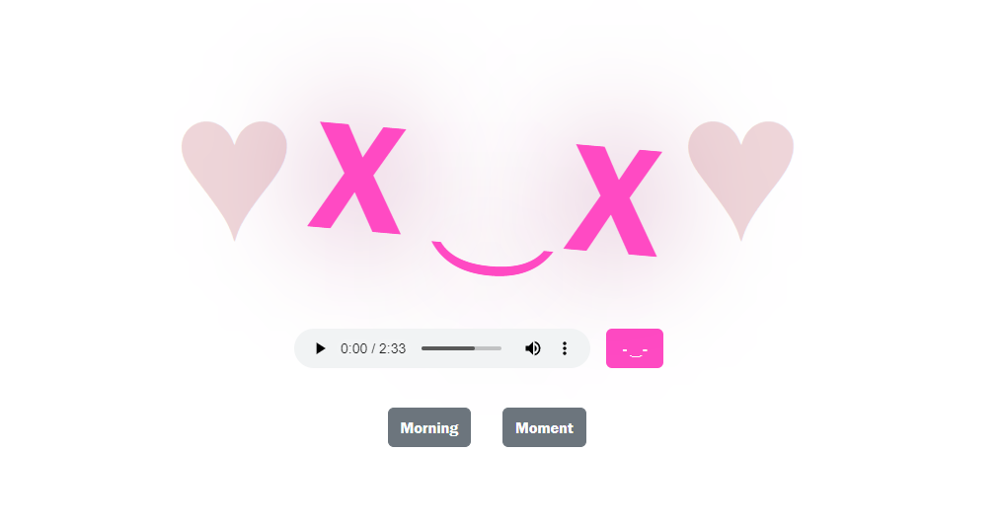

# Javascript básico demostrado en prácticas!

Este repositorio alberga mis prácticas de javascript forjadas con el conocimiento que he ido adquiriendo en <a href="https://cadif1.com">Cadi F1</a>. 
Todo lo que está aquí escrito son prácticas.

### Incluso esto de aquí es una práctica! ↓↓↓

## Acerca de este repositorio
Lo único cool que puedes encontrar aquí es esta pequeña página en la cual se puede apreciar un pequeño efécto audiovisual muy entretenido de ver y escuchar. 
Está alojada en la rama Energy y es visíble para el público gracias a GitHub Pages! 

<a href="https://wanderlust51.github.io/JS-frontEnd-Junior/">Click aquí!</a> 

(Es necesario tocar el botón de chill "-&nbsp; ͜  &nbsp;-" para que funcione, debído a políticas de google chrome)
